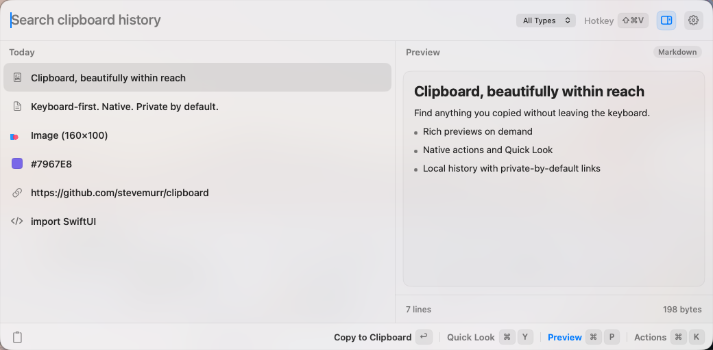

<div align="center">

# Clipboard

**A fast, native, keyboard-first clipboard history for macOS.**

Search recent text, links, colors, images, and files from a compact,
Launcher-inspired panel—then copy, open, preview, or delete without leaving
the keyboard.


</div>



## Highlights

| | |
| --- | --- |
| **Keyboard first** | Open with a configurable global shortcut, search immediately, and act on the selection without reaching for the mouse. |
| **Rich previews** | Inspect code, Markdown, images, links, YouTube videos, audio, and PDFs in an on-demand drawer. |
| **Native actions** | Copy, open, Quick Look, or delete from a compact command palette. |
| **Durable local history** | SwiftData persistence, content deduplication, source-aware search, and configurable retention from 100 items to unlimited. |
| **Optional local automation** | Approved local apps can search, read, and copy history through a paired Local MCP connection. |

Clipboard runs as a menu bar utility with no Dock icon. The panel opens at a
compact `824 × 512` points and widens only when the preview drawer is shown.

## Preview support

| Content | Preview |
| --- | --- |
| Text and colors | Selectable text and native color swatches |
| Code | Syntax-colored snippets and files with detection for Swift, JSON, TypeScript/JavaScript, Python, shell, HTML/CSS, SQL, Go, Rust, C/C++, Java, YAML, and more |
| Images | Stored clipboard images and copied image files, including transparency |
| Markdown | Rendered previews for copied Markdown and Markdown files |
| Links | Private local cards for generic HTTP/HTTPS links and rich YouTube metadata |
| Audio | AVFoundation playback with seeking and time status |
| PDF | Native PDFKit preview with page navigation for documents up to 64 MiB |
| Other files | Native file icon, metadata, Open, and Quick Look actions |

## Keyboard shortcuts

| Shortcut | Action |
| --- | --- |
| <kbd>⌘</kbd><kbd>⇧</kbd><kbd>V</kbd> | Toggle Clipboard; configurable in Settings |
| Type | Search clipboard history |
| <kbd>↑</kbd> / <kbd>↓</kbd> | Move the selection |
| <kbd>Return</kbd> | Copy the selection and close |
| <kbd>⌘</kbd><kbd>Return</kbd> | Open the selected link or file |
| <kbd>⌘</kbd><kbd>K</kbd> | Toggle Actions |
| <kbd>⌘</kbd><kbd>P</kbd> | Toggle the preview drawer |
| <kbd>⌘</kbd><kbd>Y</kbd> | Toggle macOS Quick Look |
| <kbd>⌘</kbd><kbd>Delete</kbd> | Delete the selected history item |
| <kbd>Escape</kbd> | Dismiss Actions → Quick Look → preview drawer → panel |

## Privacy and storage

Clipboard is local-first and intentionally conservative around sensitive
pasteboard data:

- History is stored with SwiftData under
  `~/Library/Application Support/Clipboard/`.
- Captured images are normalized and stored locally as PNG files. Copied files
  remain in place; Clipboard stores their filesystem paths rather than
  duplicating their contents.
- Pasteboard content marked concealed, transient, or auto-generated is skipped,
  as are Clipboard's own pasteboard writes.
- Generic link previews never contact the copied destination.
- YouTube previews are the network exception: when the drawer is open,
  Clipboard requests metadata from YouTube's official oEmbed endpoint and an
  allowlisted YouTube thumbnail host using an ephemeral, cookie-rejecting
  session.
- There is no cloud sync. Clipboard does not add application-level encryption
  to its local history.

## Local MCP

Local MCP is disabled by default. When enabled, Clipboard listens only on the
IPv4 loopback interface and advertises availability with Bonjour. Discovery
does not grant access: every new consumer must be explicitly approved using a
matching verification code.

Approved apps may use:

- `clipboard.search` — search metadata and bounded text previews
- `clipboard.get` — retrieve one history item's content
- `clipboard.copy` — place one history item back on the system clipboard

Pairing grants are stored in the Data Protection keychain and can be reviewed
or revoked in Settings. Approved access can expose sensitive clipboard history,
so enable it only for local apps you trust.

## Requirements

### Run Clipboard

- macOS 15 or later

### Build from source

- Xcode 26 or later
- [XcodeGen](https://github.com/yonaskolb/XcodeGen)
- An Apple development team for signing

The project pins its Swift package dependencies and generates
`Clipboard.xcodeproj` from [`project.yml`](project.yml). Set
`DEVELOPMENT_TEAM` in `project.yml` to your own team before generating the
project. Team signing is required for persistent Local MCP pairing grants.

```sh
brew install xcodegen
xcodegen generate

xcodebuild \
  -project Clipboard.xcodeproj \
  -scheme Clipboard \
  -configuration Debug \
  -derivedDataPath build \
  -destination 'platform=macOS' \
  build

open build/Build/Products/Debug/Clipboard.app
```

## Tests

Run the unit and regression suite on the host:

```sh
xcodebuild \
  -project Clipboard.xcodeproj \
  -scheme Clipboard \
  -configuration Debug \
  -derivedDataPath build \
  -destination 'platform=macOS' \
  test
```

The UI suite launches Clipboard with a temporary history store, but it
intentionally synthesizes keyboard input and replaces the system clipboard.
Run it in an isolated macOS VM:

```sh
xcodebuild \
  -project Clipboard.xcodeproj \
  -scheme ClipboardUITests \
  -configuration UITest \
  -derivedDataPath build \
  -destination 'platform=macOS' \
  test
```

The current verified suite contains 41 unit/regression tests and 20 end-to-end
UI tests.

## Architecture

| Layer | Technology |
| --- | --- |
| Interface | SwiftUI hosted in a borderless AppKit `NSPanel` |
| Persistence | SwiftData plus a local image store |
| System integration | AppKit pasteboard monitoring, QuickLookUI, PDFKit, and AVFoundation |
| Shortcuts | [KeyboardShortcuts](https://github.com/sindresorhus/KeyboardShortcuts) |
| Local automation | [LocalMCPKit](https://github.com/stevemurr/local-mcp-kit) |
| Project generation | XcodeGen |

The visual system was developed from a focused Launcher aesthetic study. The
design exploration and earlier mockups are available in
[`design/launcher-style-mocks`](design/launcher-style-mocks/README.md).
