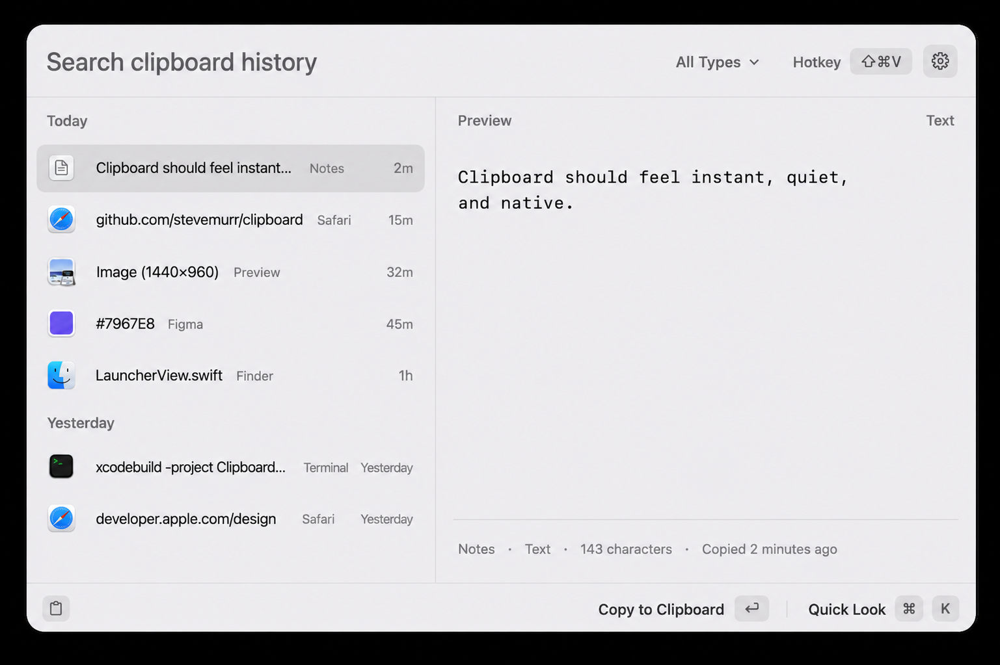
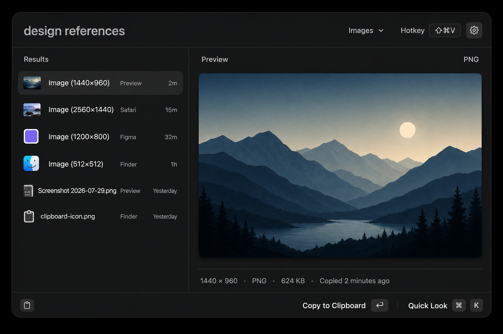
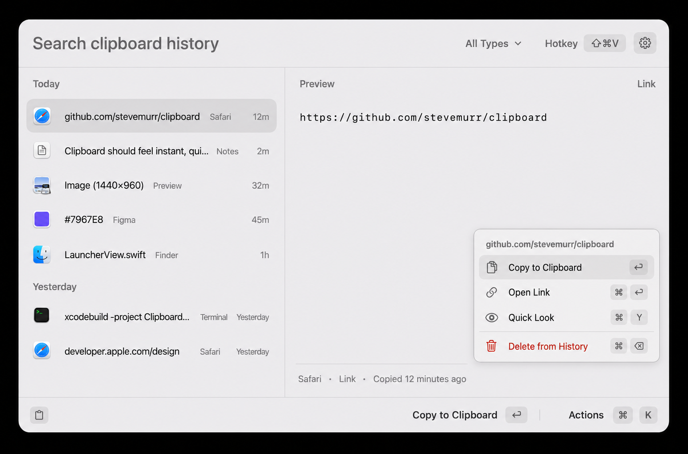
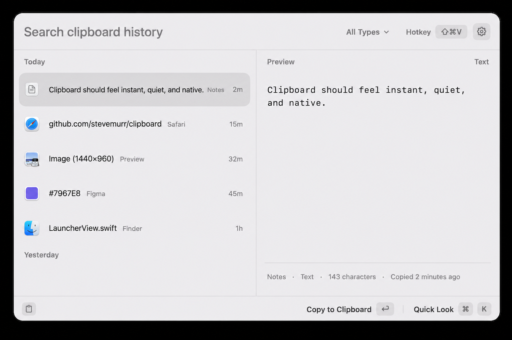
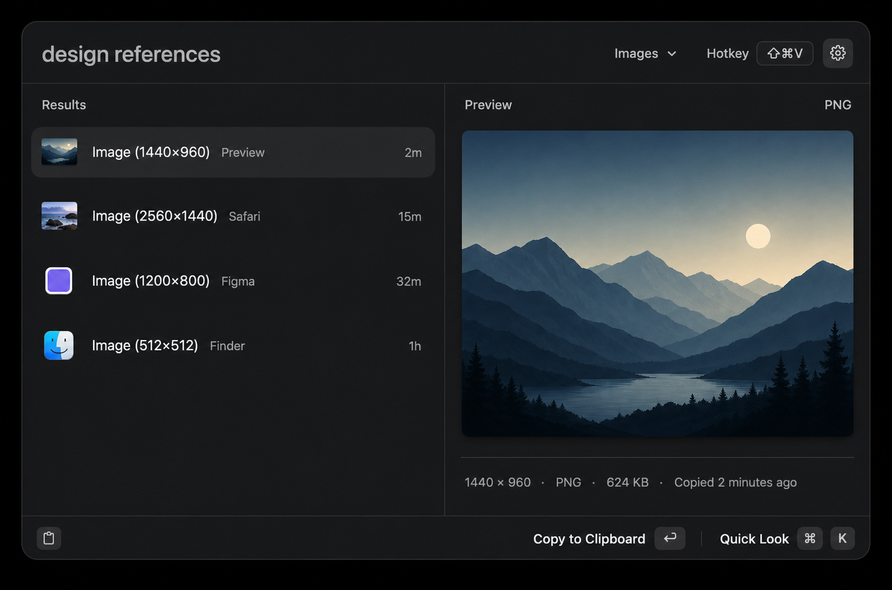
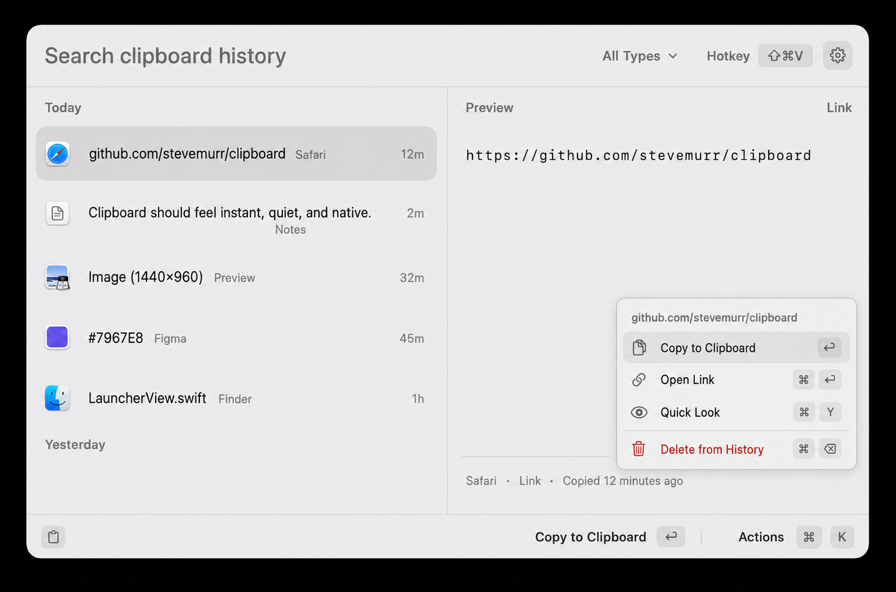
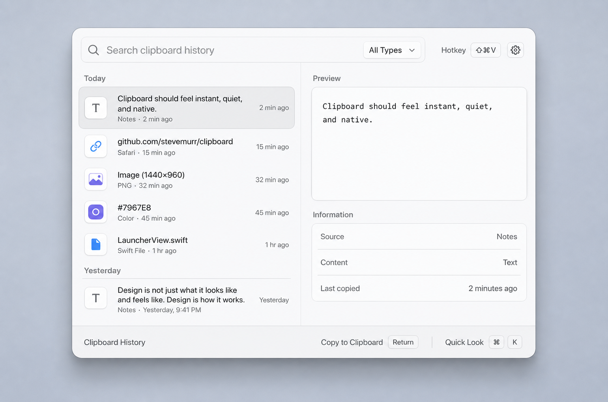
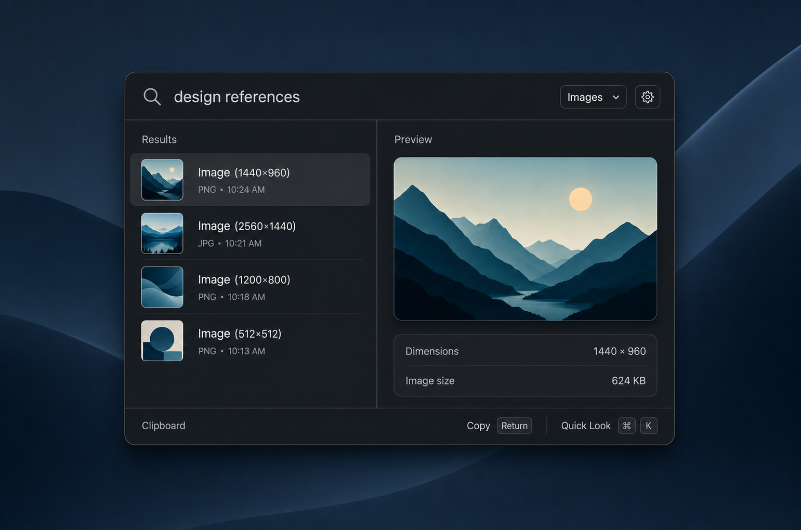
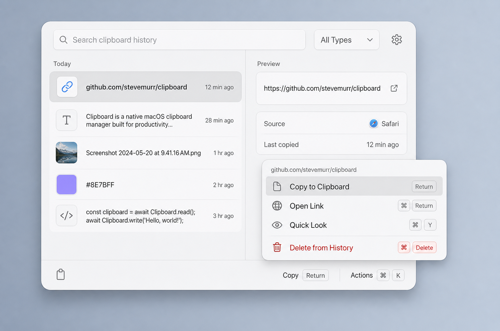

# Clipboard × Launcher visual direction

This study maps the visual standard in `../launcher` onto Clipboard without
changing Clipboard's core split-pane information architecture.

## Compact pass — denser history, larger preview

The current recommended set narrows the history pane to roughly 40% of the
panel and uses contiguous 40–42-point rows. This makes the list scan more like
Launcher and returns useful space to the preview.

### Recommended compact direction

### Compact dark appearance

### Compact action palette

## Second pass — sleek, flat, Launcher-native

The second pass responded to the rendered Launcher reference rather than only
its source-level design tokens. It removes most visible component chrome:

- Search is typography on the shared surface, not an outlined field.
- History rows are single-line and flat; only selection receives a background.
- Preview content sits directly in the pane with generous negative space.
- Metadata is one quiet strip instead of a stack of bordered cards.
- Icons are small native glyphs or thumbnails rather than boxed tiles.
- The footer and action palette use Launcher’s exact density and hierarchy.

### Recommended second-pass direction

### Second-pass dark appearance

### Second-pass action palette

## Mocks

The following images are the original first pass and are retained for
comparison.

### Recommended light direction

### Dark appearance

### Optional action palette

## What was carried over

- A 774×512 floating panel with a 16-point continuous corner radius
- Launcher’s translucent light/dark surface values and subtle separator border
- A 59-point command header with 20-point medium-weight search text
- 36-point section headers and 48-point rounded result rows
- 12–14-point cards, quiet selected-row fills, and restrained icon color
- A persistent 39-point footer with compact keyboard keycaps
- A popover-like action palette with the same surface, shadow, and row rhythm

## What remains Clipboard-specific

- The history/preview split view
- Clipboard content types, source metadata, and date sections
- Text, image, link, color, and file previews
- Clipboard's existing shortcuts in the primary concept

The action-palette mock is an optional interaction extension. Its shortcut
labels are exploratory and should be reconciled with Clipboard's existing
Command-K Quick Look behavior before implementation.
